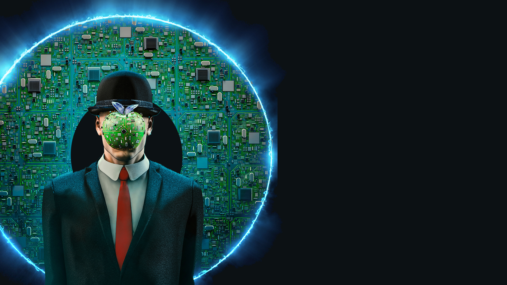

[%notitle]
== Introduction et présentation

image::images/ram.jpg[background, size=fill]

[.notes]
--
* pourquoi ce talk ?
* on ne se soucie plus de la consommation mémoire
* le coût de la RAM a baissé, et l'air du cloud et des ressources illimitées n'ont rien arrangé
* retour d'expérience sur des optimisations de consommation mémoire que nous avons effectuées il y a quelques mois
--

[%notitle.%auto-animate.columns.is-vcentered.transparency]
=== Présentation

[.column.is-two-fifth]
--
image::images/dlucas.png[]
--

[.column.has-text-left]
****

[.important-text]
--
Damien Lucas

Tech Lead

Architecte
--

image:images/onepoint.png[width=200]

[.vertical-align-middle]
icon:github[] @dlucasd

****

[%notitle.%auto-animate.columns.is-vcentered.transparency]
=== Présentation

[.column.is-two-fifth]
--
image::images/ibethus.png[]
--

[.column.has-text-left]
****

[.important-text]
--
Ivan Béthus

Tech Lead
--

image:images/onepoint.png[width=200]

[.vertical-align-middle]
icon:github[] @ibethus
****
