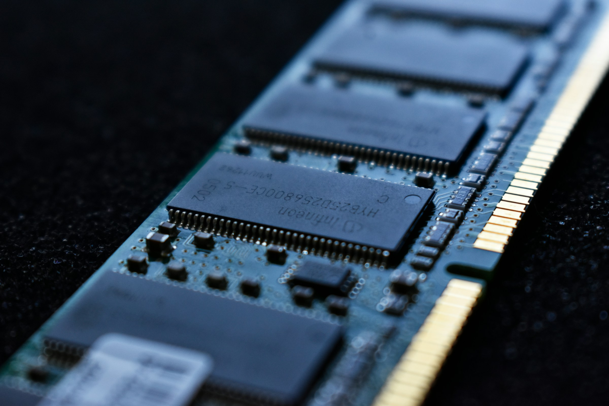

[%notitle]
== Introduction et présentation

[.notes]
--
* pourquoi ce talk ?
* à la **conception**, on ne se soucie généralement pas de la **consommation mémoire**
* le **coût de la RAM** a baissé, et l'ère du **cloud** et des ressources illimitées n'ont rien arrangé
* **retour d'expérience** sur des optimisations de consommation mémoire que nous avons effectuées il y a quelques mois
* **exemples simplifiés**, inspirés de ce que nous avons rencontré
--

[%notitle.%auto-animate.columns.is-vcentered.transparency]
=== Présentation

[.column.has-text-right.is-two-fifth]
****

[.important-text]
--
*Damien Lucas*

Tech Lead

Architecte
--

[.vertical-align-middle]
icon:github[] @dlucasd

****

[.column]
--
image::images/dlucas.png[]
--

[%notitle.%auto-animate.columns.is-vcentered.transparency]
=== Présentation

[.column.has-text-right.is-two-fifth]
****

[.important-text]
--
*Ivan Béthus*

Tech Lead
--

[.vertical-align-middle]
icon:github[] @ibethus
****

[.column]
--
image::images/ibethus.png[]
--

[.notes]
--
* on pose le décor
* bienvenue dans l'équipe Damien!
--