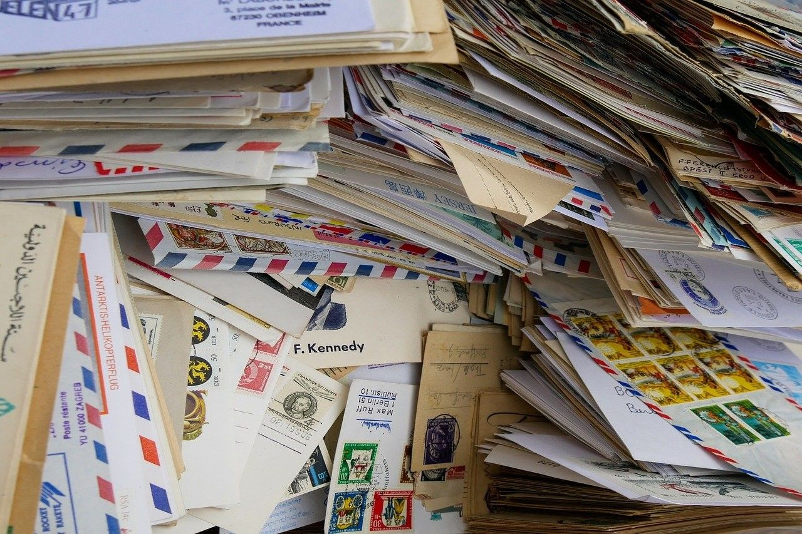
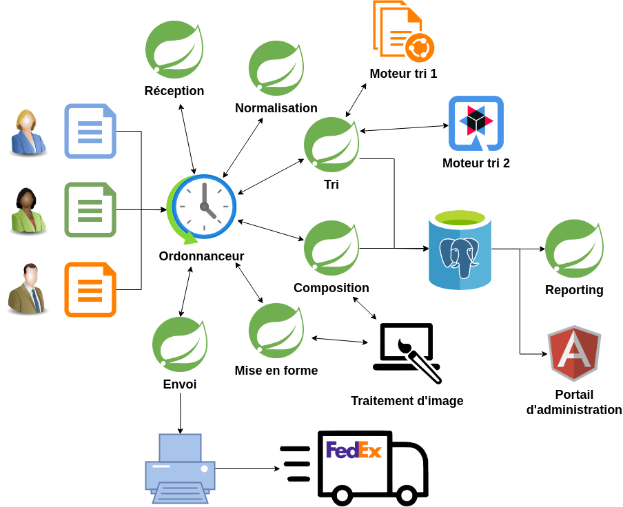

[%notitle]
== Présentation du contexte projet dans lequel nous sommes intervenus

[.notes]
--
* on fait du **courrier**
* projet **legacy** qui a grossit petit à petit
* **perte de connaissance** fonctionnelle
--

[%notitle]
=== Schéma simplifié

[.notes]
--
* chaîne batch classique
* *stack* : Java, Spring, PostgreSQL 
* chaque année, forte volumétrie en fin d'année, environ 4 millions de courriers
* l'année dernière, consommation mémoire 96go atteinte

* Damien : attend c'est pas normal! 96Go pour ça ?
* ok alors en fait, la chaîne est un peu plus complexe
--

[%notitle]
=== Schéma plus exhaustif

[.notes]
--
* *ordonnanceur* au centre de l'appli, *progiciel* de traitement d'image, *moteurs* de tri, *portail*
* *parallélisation* des traitements
* le *tout déployé sur un serveur*, pas de conteneurisation
* problématique : cette année, un peu plus de volumétrie et le client nous confie que la *chaîne consomme de plus en plus* de RAM
* client pas confiant pour les traitements de fin d'année
--
