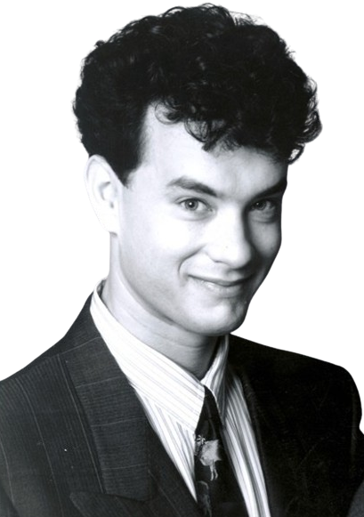

[.columns.is-vcentered]
== _To be continued..._

[.notes]
--
* plein de choses à faire encore
* *observabilité*, *metrics*, *logs*
* *test de perf* automatisés pour anticiper
* ne pas hésiter à utiliser le profiling intégré dans IntelliJ
--

[%notitle.columns.is-vcentered]
=== Merci

[.column]

[.column]
****

T.HANKS
****

[.column]

[.notes]
--
* https://q-r-code.fr/
--